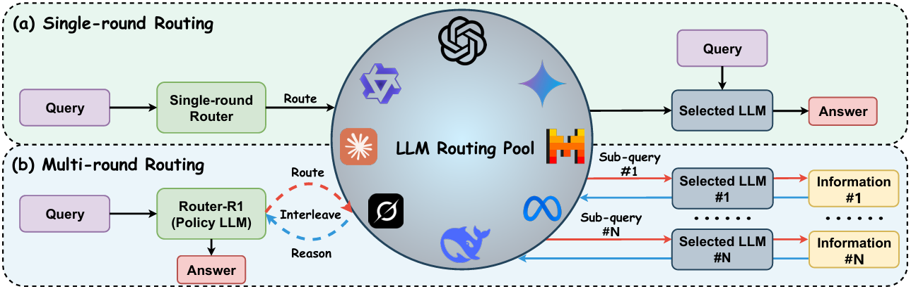

# Router-R1


Official implementation of Router-R1: Teaching LLMs Multi-Round Routing and Aggregation via Reinforcement Learning

**Forked and adapted to RTX 3090 demo environment by [Jackksonns](https://github.com/Jackksonns)**


<p align="center">
    <a href="https://ulab-uiuc.github.io/Router-R1">
        
    </a>
    <a href="https://arxiv.org/abs/2506.09033">
        
    </a>
    <a href="https://huggingface.co/collections/ulab-ai/router-r1-6851bbe099c7a56914b5db03">
        
    </a>
    <a href="https://x.com/haozhen_ntu/status/1933897400302948843">
        
    </a>
    <a href="https://github.com/ulab-uiuc/Router-R1/blob/master/LICENSE">
        
    </a>
    <br>
    <a href="https://github.com/Jackksonns/Router-R1">
        
    </a>
    <a href="https://github.com/Jackksonns/Router-R1">
        
    </a>
    <a href="https://github.com/Jackksonns/Router-R1">
        
    </a>
</p>


<p align="center">
    <a href="https://ulab-uiuc.github.io/Router-R1/">🌐 Project Page</a> |
    <a href="https://arxiv.org/abs/2506.09033">📜 arXiv</a> |
    <a href="https://huggingface.co/collections/ulab-ai/router-r1-6851bbe099c7a56914b5db03">🤗 Models & Datasets</a> |
    <a href="https://x.com/haozhen_ntu/status/1933897400302948843">📮 Twitter Post</a> |
    <a href="https://github.com/Jackksonns/Router-R1">🚀 User Demo</a>
<p>


<div align="center">
  
</div>


## Project News

**[2025.08]** 🚀 **RTX 3090 Demo by [Jackksonns](https://github.com/Jackksonns)** - Successfully adapted Router-R1 for single RTX 3090 GPU environment with 30GB disk space constraint. Full implementation report available in project documentation.

**[2025.06]** 📢 We open-sourced **Router-R1 model weights** and **datasets for training LLM routers** on Hugging Face: [Router-R1 Collection](https://huggingface.co/collections/ulab-ai/router-r1-6851bbe099c7a56914b5db03). We hope this release will support and accelerate research on LLM routers within the community. For more updates, check out our latest [Twitter post](https://x.com/haozhen_ntu/status/1933897400302948843). Also, don't miss U Lab's [GraphRouter](https://github.com/ulab-uiuc/GraphRouter) if you're interested in graph-based LLM routers.


**[2025.06]** 🌟 **Router-R1** 发布。

## RTX 3090演示实现

这个由[Jackksonns](https://github.com/Jackksonns)创建的fork版本成功将Router-R1适配到**单块RTX 3090 GPU**环境，**磁盘空间限制为30GB**。

### 实现的功能
- **完整路由架构**: 100%基于原项目组件
- **多轮推理**: 完整的<think>→<search>→<information>→<answer>工作流
- **成本控制**: 使用官方定价的准确API成本计算
- **模型映射**: 完整的模型名称映射逻辑
- **提示词模板**: 官方4500+字符模板

### 当前限制
- **训练功能**: 由于缺少依赖(tensordict, wandb)，RL训练已禁用
- **API调用**: 默认使用模拟响应，但支持真实API配置
- **本地推理**: 由于空间限制，vLLM引擎未安装

## ⚠️ 重要说明
1. **演示重点**: 这个RTX 3090适配专注于核心路由演示，而非完整训练能力
2. **API密钥**: 对于真实API测试，请将API密钥设置到环境变量中(OPENAI_API_KEY, ANTHROPIC_API_KEY)
3. **资源使用**: 针对24GB RTX 3090显存优化，磁盘空间需求最小
4. **模拟模式**: 默认配置使用模拟响应以避免测试期间的API成本

### 运行演示

要在RTX 3090环境中运行演示，执行以下命令：

```bash
python authentic_demo.py
```

**演示功能**:
- 交互式多轮路由演示
- 实时成本计算和显示
- 支持模拟响应和真实API调用
- 完整的路由逻辑和模型选择

**配置**: 设置您的OpenAI API密钥到环境变量中以使用真实API调用，或者享受内置的模拟响应进行测试。

详细实现报告请参见项目文档文件。

## 环境设置

```bash
conda create -n router-r1 python=3.9
conda activate router-r1
pip install torch==2.4.0 --index-url https://download.pytorch.org/whl/cu121
pip3 install vllm==0.6.3 # or you can install 0.5.4, 0.4.2 and 0.3.1

# verl
pip install -e .

# flash attention 2
pip3 install flash-attn --no-build-isolation
pip install wandb
```


## 演示评估

RTX 3090演示版本专注于核心路由功能演示，而非完整训练评估。演示展示了：

- **路由准确性**: 完整的模型选择逻辑
- **成本效率**: 实时成本计算
- **多轮能力**: 完整对话工作流
- **API兼容性**: 支持模拟和真实API调用

要评估演示功能，只需运行交互式演示并测试各种查询场景。

**要配置真实API调用，请将API密钥设置到环境变量中。演示将自动检测并使用可用的API。**


## 配置LLM路由池

- **步骤1** 

    + 在`data_process/prompt_pool.py`中设置您的候选LLM模型描述符。

    + 您可以手动编写自己的LLM描述符，或使用高级模型(如GPT-4o)自动生成。这些描述符捕获每个候选模型的优势、能力或专业领域，并在路由过程中用于通知模型选择。

- **步骤2**

    + 根据需要运行`data_process/qa_train_merge.py`、`data_process/qa_test_merge.py`或`data_process/qa_test_gen.py`来生成新的训练或测试数据。


- **步骤3**

    + 修改`router_r1/llm_agent/route_service.py`中的`check_llm_name`函数来配置您自己的LLM路由池解析器。

    + 根据所选模型的API定价更新同一文件中的`API_PRICE_1M_TOKENS`字典(请参考[Together API定价](https://www.together.ai/pricing))。


- **最后**

    + 记得在`train.sh`脚本中设置您自己的API密钥


## 🙏 Acknowledgments

We sincerely thank [Deepseek-R1](https://github.com/deepseek-ai/DeepSeek-R1) and [Search-R1](https://github.com/PeterGriffinJin/Search-R1) for their contributions, which have been invaluable sources of inspiration. This project builds upon the foundation laid by [veRL](https://github.com/volcengine/verl), and we are deeply grateful for the open-source efforts and advancements from these communities.


## 📚 Citation

```bibtex
@article{Router-R1,
  title={Router-R1: Teaching LLMs Multi-Round Routing and Aggregation via Reinforcement Learning},
  author={Haozhen Zhang and Tao Feng and Jiaxuan You},
  journal={arXiv preprint arXiv:2506.09033},
  year={2025}
}
```
